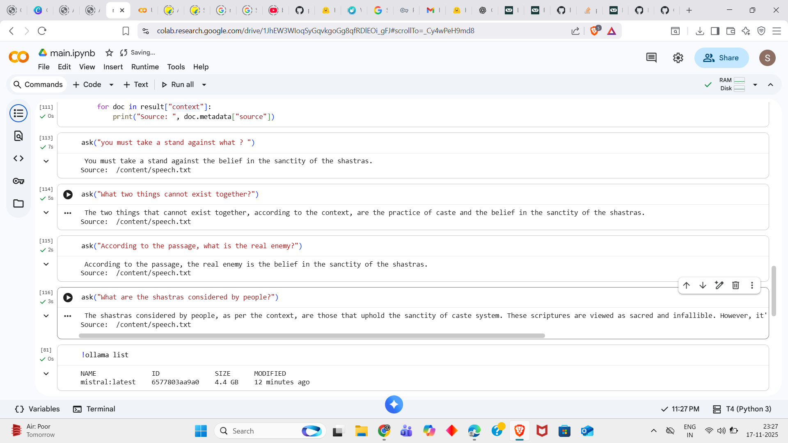

# AmbedkarGPT-Intern-Task

## Retrieval-Augmented Generation (RAG) Pipeline using LangChain + Ollama




This project implements a lightweight, local-first RAG pipeline using LangChain, Ollama, and Chroma for vector search.
It allows you to ingest text files, build embeddings, store them in a vector database, and ask questions with accurate,
context-aware retrieval.

## Features
- Document ingestion with automatic chunking  
- RAG chain combining retrieval + LLM generation  
- Local LLMs via Ollama (Mistral, LLaMA, etc.)  
- Simple interactive ask() function  
- Fast embeddings using FastEmbed  
- Embedded ChromaDB for vector storage  
- Modular functions (ingest, rag_chain, ask)

## 📁 Project Overview
```
main.ipynb
│
├── ingest()        # Loads text files & creates a vector store
├── rag_chain()     # Builds the RAG pipeline using retriever + LLM
└── ask(query)      # Ask questions grounded in your documents
```

## Installation

### 1. Install dependencies
```
pip install -r requirements.txt
```

### 2. Install Ollama
Download from https://ollama.com  

Pull a model:
```
ollama pull mistral
```
Start server:
```
ollama serve
```

## Usage

### 1. Ingest documents
```
ingest()
```

### 2. Build the RAG chain
```
rag_chain()
```

### 3. Ask questions
```
ask("What must you take a stand against?")
```

## Requirements
```
langchain
langchain-community
langchain-core
langchain-text-splitters
langchain-chroma
langchain-ollama
langchain-classic
```

### ! Caution: If you encounter a login error during ingest()
```
from huggingface_hub import login

access_token_read = "your_read_access_token_here"
access_token_write = "your_write_access_token_here"

login(token=access_token_read)
```

Run this in a separate cell, then execute ingest() again.
This will resolve any login-related issues.


### Thank you for the Opportunity 

